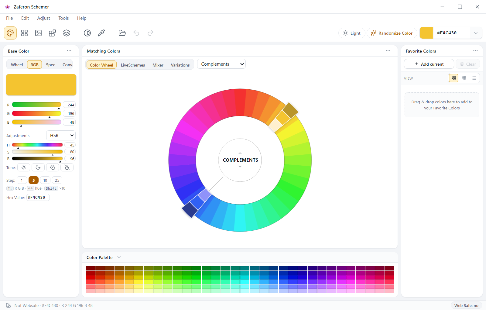
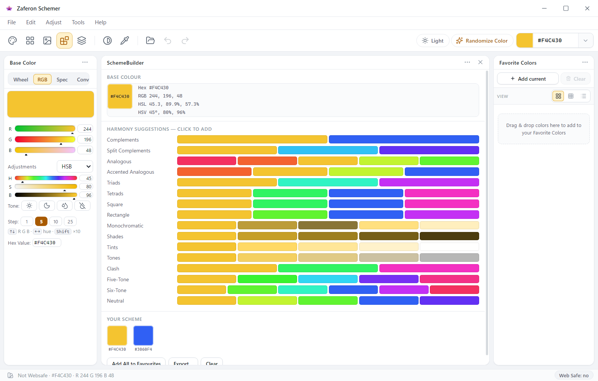

# Zaferon Schemer

A desktop colour studio: a harmony wheel, live schemes, a mixer, variations, photo colour extraction and a
full-screen eyedropper. **Your work never leaves the machine** — no account, no telemetry, no cloud storage.

Zaferon (زعفران) is Persian for saffron — the colour the app opens on.

<p align="center">
  <br>
  <b>Matching Colors</b> — set a base colour, then read every harmony off the wheel.
</p>

<p align="center">
  <br>
  <b>SchemeBuilder</b> — every harmony, tint, shade and tone of the base colour, one click to add it.
</p>

## Features

- **Matching Colors** — a base-colour wheel over 16 harmony schemes (complements, analogues, triads, tetrads
  and friends), plus RGB / HSV / Spec / Convert tabs and a tone row that nudges brightness and saturation.
- **LiveSchemes** — up to eight handles you drag around a hue ring; the scheme and the palette strip update as
  you move them.
- **Color Mixer** — blend two colours by weight, with drag-and-drop from any swatch in the app.
- **Variations** — tints, shades and tones of the current colour, generated as a grid.
- **PhotoSchemer** — extract a palette from an image, with quantisation and per-region sampling.
- **SchemeBuilder, Gallery and SchemeBrowser** — arrange palettes by hand, or start from bundled schemes.
- **Screen eyedropper (F3)** — freezes the desktop full-screen with a loupe on the cursor; click any pixel on
  any monitor to sample it, Esc to cancel.
- **Colour-vision simulation** — protanopia, deuteranopia and tritanopia plus their anomalous variants,
  achromatopsia and grayscale.
- **Contrast analyzer (Ctrl+A)** — WCAG ratios between the current colour and any favourite.
- **Named-colour libraries** — HTML, Material, Classic, Utility and Retro, searchable.
- **Export and import** — Adobe Swatch Exchange (.ase), palette files, and whole workspaces.
- **Light and dark themes**, a persistent workspace, and undo/redo of colour history.
- **Self-updating** — an installed build checks GitHub Releases about ten seconds after launch and offers a
  banner: *Download* fetches the update, *Install & Restart* applies it. Nothing is downloaded unless you ask,
  and the check only exists in a packaged build — running from source makes no requests at all. Not every format
  can replace itself; see *Auto-update, per platform* below.
- **No telemetry.** The renderer cannot reach the network even if it wanted to: its CSP is
  `default-src 'self' file:`, which covers `connect-src` as well as scripts, and it has no Node access at all. QR
  codes are generated locally. The one outbound call in the app is that release check, made from the main
  process.

## Download

Packaged builds are on **[Releases](https://github.com/abas619/zaferon-schemer/releases)**. Each release carries
one file per format below, named after the app and the version — the release page lists them with their exact
names. Pick the one for your system:

| Your system | File ending | What it is |
|---|---|---|
| Windows 10 / 11 (64-bit) | `-Setup-<version>.exe` | Installer. Puts a Start-menu entry and an uninstaller in its own folder; **updates itself**. |
| Windows, no install | `-Portable-<version>.exe` | One .exe you can keep on a stick or in a folder. Nothing is installed, so there is nothing to replace — **it cannot update itself**. |
| Any Linux | `.AppImage` | `chmod +x` it and run. **The only Linux build that updates itself.** On newer Ubuntu/Debian you may need `sudo apt install libfuse2` first. |
| Debian, Ubuntu, Mint, Pop!_OS | `_amd64.deb` | `sudo apt install ./<file>.deb` |
| Fedora, openSUSE, RHEL | `.x86_64.rpm` | `sudo dnf install ./<file>.rpm` |
| macOS (Intel or Apple silicon) | `.dmg` | Built for both architectures; the file name says which. The `.zip` beside it is the same app for tooling that cannot mount a dmg. See *unsigned*, below. |

### macOS: the build is unsigned

Releases are built on GitHub's runners without an Apple Developer ID, so macOS cannot verify the author — this is
a statement about who paid Apple, not about what the app does. On first launch:

1. Open it and let Gatekeeper refuse.
2. **System Settings ▸ Privacy & Security ▸ "Open Anyway"** — on macOS 15 and later. On older versions, right-click
   the app ▸ **Open** instead.

Signing and notarizing would also let the app **update itself on macOS** — electron-updater refuses to swap in an
update it cannot match against the running app's signature, so the mac build tells you a release exists and leaves
you to download it.

### Auto-update, per platform

The banner in the app (*Download* → *Install & Restart*) only does something where the format allows it:

- **Windows installer** — yes, in place.
- **AppImage** — yes; it replaces the .AppImage you ran.
- **deb / rpm** — no: those are package-manager installs, and the updater deliberately stands aside. Run
  **Help ▸ Check for Updates…** and it will point you at the release page instead.
- **Windows portable** — no: it is a single .exe, and `Install & Restart` on it would run a real installer and
  quietly create an installed copy you never asked for. The dialog says so instead.
- **macOS** — no, while unsigned (above).

## Run from source

```bash
git clone https://github.com/abas619/zaferon-schemer.git
cd zaferon-schemer
npm install
npm start
```

Electron 33 and plain JavaScript — there is no bundler, no framework and no build step for the renderer, so
editing a file in `src/` and reloading the window is the whole development loop. `npm run` lists the test
harnesses that cover the parts a screenshot cannot show.

To produce your own builds: `npm run dist:win`, `dist:linux` or `dist:mac` writes `dist/` via electron-builder
(`npm run dist` builds for whichever system you are on). The Linux and macOS builds must run on their own kind of
machine, so the release itself is made by CI: pushing a `v*` tag runs all three on GitHub's runners and attaches
every artifact to one Release, along with the `latest.yml` / `latest-linux.yml` / `latest-mac.yml` files the updater
reads ([`.github/workflows/release.yml`](.github/workflows/release.yml)). That is where the downloadable builds come
from.

## Support the project

Zaferon Schemer is free and offline. If it is useful to you, you can say so — every channel below is also
available in-app as **Help ▸ Support Zaferon Schemer…**, where each address comes with a scannable QR code and
a Copy button.

| Channel | Address |
|---|---|
| Tether (USDT) — TRON network · TRC20 | `TJupoUwfAs9Dwm1TafvJeAH7BuhHVKiMeK` |

**Public receive addresses only.** No one from this project will ever ask for your private key, seed phrase or
wallet password — anyone who does is not us.

## Licence

[MIT](LICENSE) — © 2026 Abbas (abas619).
